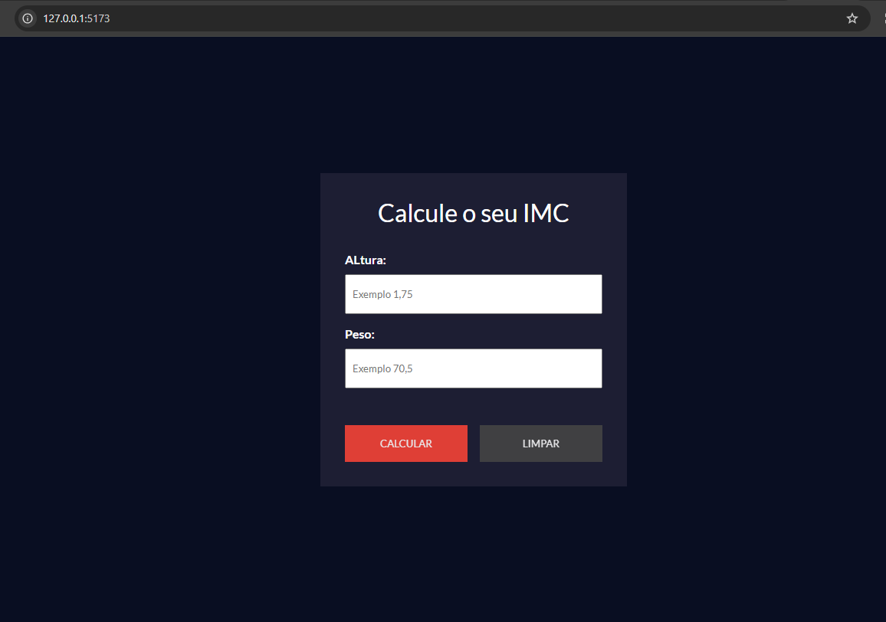
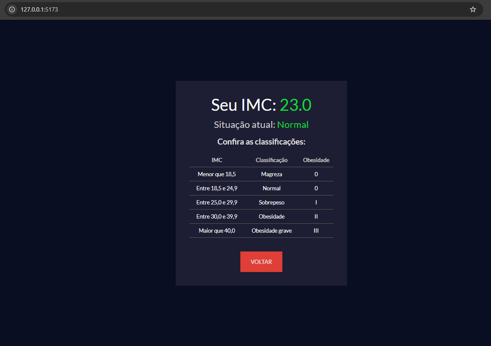

# 🧮 Calcule o seu IMC

Um projeto moderno desenvolvido em **React** com **Vite** para calcular o Índice de Massa Corporal (IMC). A aplicação possui uma interface intuitiva e dinâmica que guia o usuário por duas etapas simples para exibir o resultado da análise de peso.

---

## 📸 Demonstração do Projeto

Aqui estão as duas fases principais do fluxo da aplicação:

### Fase 1: Entrada de Dados

_Onde o usuário insere as informações de peso e altura._


### Fase 2: Resultado e Classificação

_Tela exibida após clicar em calcular, ocultando a primeira fase e mostrando a tabela correspondente._


_(Substitua `caminho_da_imagem_fase1.png` e `caminho_da_imagem_fase2.png` pelo caminho real das suas imagens ou links do GitHub/Imgur)_

---

## 🚀 Como o Projeto Funciona

O fluxo da aplicação é dividido em duas fases para melhorar a experiência do usuário (UX):

1. **Fase 1 (Entrada):** O usuário preenche os campos de **Altura (cm)** e **Peso (kg)** e clica no botão "Calcular".
2. **Fase 2 (Resultado):** A tela inicial é ocultada dinamicamente, e uma nova interface exibe o valor do IMC calculado junto com a tabela oficial de classificação (Abaixo do peso, Peso normal, Sobrepeso, Obesidade, etc.).

---

## 🛠️ Tecnologias Utilizadas

- [React](https://reactjs.org/) - Biblioteca JavaScript para construção de interfaces.
- [Vite](https://vitejs.dev/) - Build tool ultra-rápido para desenvolvimento frontend moderno.
- JavaScript (ES6+) / CSS3 / HTML5

---

## 💻 Como Executar o Projeto

### Pré-requisitos

Antes de começar, você vai precisar ter o [Node.js](https://nodejs.org/) instalado em sua máquina.

### Passos para Instalação e Inicialização

Se você estivesse criando este projeto do zero, o comando utilizado para iniciar o React com Vite seria:

```bash
npm create vite@latest calcule-seu-imc -- --template react
```

Para rodar este repositório localmente, siga os passos abaixo no seu terminal:

1. **Clone o repositório:**

```bash
   git clone [https://github.com/seu-usuario/seu-repositorio.git](https://github.com/seu-usuario/seu-repositorio.git)
```

2. **Acesse a pasta do projeto:**

```bash
    cd seu-repositorio
```

3. **Instale as dependências:**

```bash
    npm install
```

4. **Inicie o servidor de desenvolvimento:**

```bash
    npm run dev
```

Depois disso, o Vite gerará um link local (geralmente http://localhost:5173/). Basta abrir esse endereço no seu navegador para ver o projeto rodando!

Feito com ❤️ por Aldo Santos
